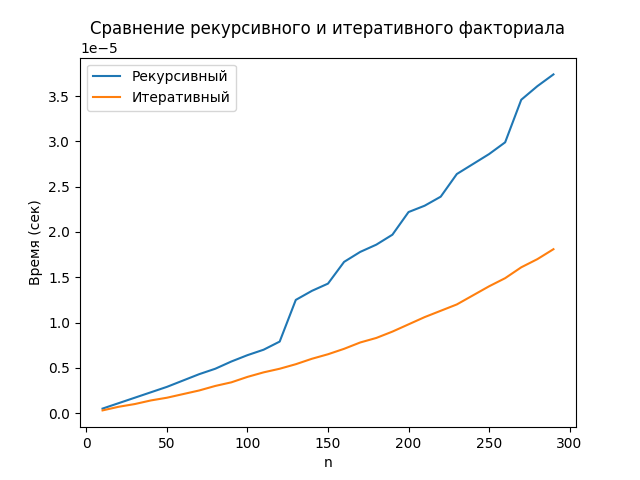

# Лабораторная работа 4. Сравнение работы функций. Профайлинг
Выполнена Голубковым Никитой


### Используемый код:
```python
import timeit
import matplotlib.pyplot as plt
import random


def fact_recursive(n: int) -> int:
    """Рекурсивный факториал"""
    if n == 0:
        return 1
    return n * fact_recursive(n - 1)


def fact_iterative(n: int) -> int:
    """Нерекурсивный факториал"""
    res = 1
    for i in range(1, n + 1):
        res *= i
    return res


def benchmark(func, n, repeat=5):
    """Возвращает среднее время выполнения func(n)"""
    times = timeit.repeat(lambda: func(n), number=1, repeat=repeat)
    return min(times)


def main():
    # фиксированный набор данных
    random.seed(42)
    test_data = list(range(10, 300, 10))

    res_recursive = []
    res_iterative = []

    for n in test_data:
      res_recursive.append(benchmark(fact_recursive, n, 5000))
      res_iterative.append(benchmark(fact_iterative, n, 5000))

    # Визуализация
    plt.plot(test_data, res_recursive, label="Рекурсивный")
    plt.plot(test_data, res_iterative, label="Итеративный")
    plt.xlabel("n")
    plt.ylabel("Время (сек)")
    plt.title("Сравнение рекурсивного и итеративного факториала")
    plt.legend()
    plt.show()


if __name__ == "__main__":
    main()
```
## Результат исполнения кода в Google Collab


## Результат исполнения кода на персональном компьютере


# Вывод:
Как показало два теста, итеративный вариант кода гораздо быстрее рекурсивного.
При этом использование кода на персональном компьютере получилось примерно в полтора раза быстрее, чем в Google Colab, без резких перепадов времени 