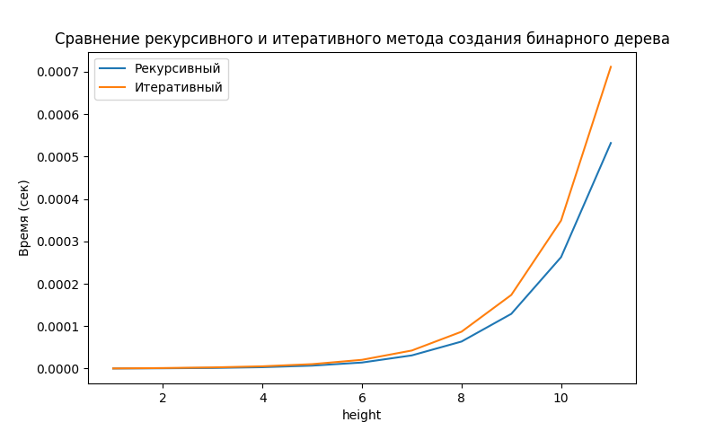

# Лабораторная работа 6. ССравнение реализаций построения бинарного дерева.
Выполнена Голубковым Никитой


### Используемый код:
```python
import timeit
import matplotlib.pyplot as plt
import random


def build_tree_recursive(root: int = 4, height: int = 4) -> dict | Exception:
    """Рекурсивное создание дерева"""
    if isinstance(root, int) and isinstance(height, int):
        if height >= 1:
            left_leaf = root * 4  # Формула для указателя левого узла
            right_leaf = root + 1  # Формула для указателя правого узла

            if isinstance(left_leaf, int) and isinstance(right_leaf, int):
                if height - 1:

                    # Создание ветвей бинарного дерева
                    return {root: [build_tree_recursive(left_leaf, height - 1),
                                   build_tree_recursive(right_leaf, height - 1)]}

                # Выход из рекурсии
                return {root: []}

            raise ValueError("Значения left_leaf и right_leaf должны быть целыми числам")
        raise ValueError("Значение параметра height должно быть больше 0")

    if not isinstance(root, int):
        raise TypeError("Значение параметра root должно являться целым числом")

    raise TypeError("Значение параметра height должно являться целым числом")


def build_tree_iterative(root: int = 4, height: int = 4,
                 left_branch=lambda x: x * 4, right_branch=lambda x: x + 1) -> dict | Exception:
    """Итеративное создание дерева"""
    if not isinstance(root, int):
        raise TypeError("Значение параметра root должно являться целым числом")
    if not isinstance(height, int):
        raise TypeError("Значение параметра height должно являться целым числом")

    if height < 1:
        raise ValueError("Значение параметра height должно быть больше 0")

    # Создание каждого листка дерева
    stack = [[{root: []}]]
    for cur_height in range(height - 1):
        new_level = []

        for cur_root in stack[cur_height]:
            new_level.append({left_branch(tuple(cur_root.keys())[0]): []})
            new_level.append({right_branch(tuple(cur_root.keys())[0]): []})

        stack.append(new_level)

    # Сборка дерева, начиная с нижнего уровня
    for i in range(height - 1, 0, -1):
        for j in range(2 ** (i - 1)):
            current_key = tuple(stack[i - 1][j].keys())[0]
            stack[i - 1][j][current_key] = stack[i][j * 2: (j + 1) * 2]
        del stack[i]

    return stack[0][0]


def benchmark(func, n, repeat=5):
    """Возвращает среднее время выполнения func(n)"""
    times = timeit.repeat(lambda: func(4, n), number=1, repeat=repeat)
    return min(times)


def main():
    # фиксированный набор данных
    random.seed(42)
    test_data = list(range(1, 12))

    res_recursive = []
    res_iterative = []

    for n in test_data:
      res_recursive.append(benchmark(build_tree_recursive, n, 5000))
      res_iterative.append(benchmark(build_tree_iterative, n, 5000))

    # Визуализация
    plt.plot(test_data, res_recursive, label="Рекурсивный")
    plt.plot(test_data, res_iterative, label="Итеративный")
    plt.xlabel("height")
    plt.ylabel("Время (сек)")
    plt.title("Сравнение рекурсивного и итеративного метода создания бинарного дерева")
    plt.legend()
    plt.show()


if __name__ == "__main__":
    main()
```

## Результат исполнения кода на персональном компьютере


# Вывод:
Как показал тест функций, мой итеративный вариант кода работает медленнее рекурсивного варианта. Особенно это заметно при увеличении высоты дерева.
Данные результаты могут быть связаны с тем, что реализация рекурсивного метода оптимальна, а итеративного - нет.