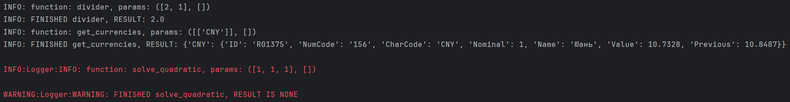
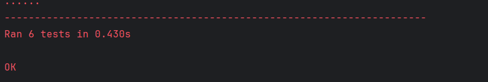

# Лабораторная работа 7. Логирование и обработка ошибок в Python.
Выполнена Голубковым Никитой

## Код написанного декоратора:

```python
import sys
import functools
import io
import logging


def logger(func=None, *, handle: io.TextIOWrapper | io.StringIO | logging.Logger = sys.stdout):
    if func is None:
        return lambda func: logger(func, handle=handle)

    @functools.wraps(func)
    def inner(*args, **kwargs):
        # Инициализация функций логирования
        if isinstance(handle, logging.Logger):
            # Логирование в логгер
            def info(to_log):
                handle.info(to_log)
            def warning(to_log):
                handle.warning(to_log)
            def error(to_log):
                handle.error(to_log)
            def critical(to_log):
                handle.critical(to_log)

        else:
            # Логирование в поток
            def info(to_log):
                handle.write(to_log)
                handle.flush()
            def warning(to_log):
                handle.write(to_log)
                handle.flush()
            def error(to_log):
                handle.write(to_log)
                handle.flush()
            def critical(to_log):
                handle.write(to_log)
                handle.flush()

        args_to_log = [param for param in args]
        kwargs_to_log = [(key, value) for key, value in kwargs.items()]
        all_params = (args_to_log, kwargs_to_log)
        info(f"INFO: function: {func.__name__}, params: {all_params}\n")

        try:
            # Лог выполненной функции
            output = func(*args, **kwargs)
            if output is not None:
                info(f"INFO: FINISHED {func.__name__}, RESULT: {output}\n")
            else:
                warning(f"WARNING: FINISHED {func.__name__}, RESULT IS NONE: {output}\n")

            return output

        except Exception as e:
            # Лог ошибки
            if isinstance(e, TypeError):
                critical(f"CRITICAL: UNFINISHED {func.__name__}, CRITICAL   : {type(e).__name__}: {e}\n")
            else:
                error(f"ERROR: UNFINISHED {func.__name__}, ERROR: {type(e).__name__}: {e}\n")

            raise e

    return inner
```

## Код функции `get_currencies`
```python
import requests


def get_currencies(currency_codes: list | None = None, url: str = "https://www.cbr-xml-daily.ru/daily_json.js") -> dict:
    try:
        response = requests.get(url)
        response.raise_for_status()  # Проверка на ошибки HTTP
        data = response.json()
        currencies = {}

        if "Valute" in data:
            if not currency_codes:
                currency_codes: list = list(data["Valute"].keys())

            for code in currency_codes:
                if code in data["Valute"]:
                    currencies[code] = data["Valute"][code]
                else:
                    currencies[code] = f"Код валюты '{code}' не найден."
        return currencies

    except requests.exceptions.RequestException as error:
            raise requests.exceptions.RequestException(f'Ошибка подключения к API ЦБ Российской Федерации: {error}')
```

## Код функции `solve_quadratics`
```python
from math import sqrt


def solve_quadratic(a, b, c):
    # Ошибка типов
    for name, value in zip(("a", "b", "c"), (a, b, c)):
        if not isinstance(value, (int, float)):
            raise TypeError(f"Coefficient '{name}' must be numeric")

    # Ошибка: a == 0
    if a == 0:
        raise ValueError("a cannot be zero")

    d = pow(b, 2) - (4 * a * c)

    if d < 0:
        return None

    if d == 0:
        x = -b / (2 * a)
        return (x,)

    root1 = (-b + sqrt(d)) / (2 * a)
    root2 = (-b - sqrt(d)) / (2 * a)
    return root1, root2
```

## Примеры логов


## Тесты
```python
import io
import logging

import requests
from unittest import TestCase, main
from get_currency import get_currencies
from logger import logger
from quadratics import solve_quadratic

class TestGetCurrencies(TestCase):
    # Получение всех возможных котировок
    def test_get_all_currencies(self):
        self.assertIsInstance(get_currencies(), dict)

    # Получение определённой котировки по коду
    def test_get_some_currencies(self):
        self.assertIsInstance(get_currencies(['USD']), dict)
        self.assertEqual(get_currencies(['AUD'])['AUD']['NumCode'], '036')

    # Неверная подача данных функции
    def test_currencies_invalid_input(self):
        self.assertRaises(TypeError, get_currencies, 123)

    # Ошибка подключения к сайту
    def test_currencies_api_error(self):
        self.assertRaises(requests.exceptions.RequestException, get_currencies, ['USD', 'AUD'], 'https:/')

class TestLogger(TestCase):
    def setUp(self):
        self.nonstandard_stream = io.StringIO()

    # Логирование функции подключения к API
    def test_get_currencies_stringio(self):
        @logger(handle=self.nonstandard_stream)
        def function(codes):
            return get_currencies(codes)

        with self.assertRaises(TypeError):
            function(3456789)

        logs = self.nonstandard_stream.getvalue()
        self.assertIn("INFO", logs)
        self.assertIn('CRITICAL', logs)

        self.nonstandard_stream.truncate(0)

    # Логирование функции решения квадратного уравнения
    def test_solve_quadratics_stringio(self):
        @logger(handle=self.nonstandard_stream)
        def function(a, b, c):
            return solve_quadratic(a, b, c)

        with self.assertRaises(ValueError):
            function(0, 1, 2)

        logs = self.nonstandard_stream.getvalue()
        self.assertIn("INFO", logs)
        self.assertIn('ERROR', logs)

        self.nonstandard_stream.truncate(0)

    def tearDown(self):
        del self.nonstandard_stream


if __name__ == '__main__':
    main()
```
