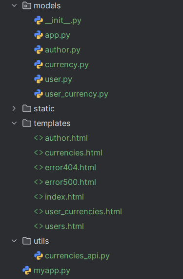
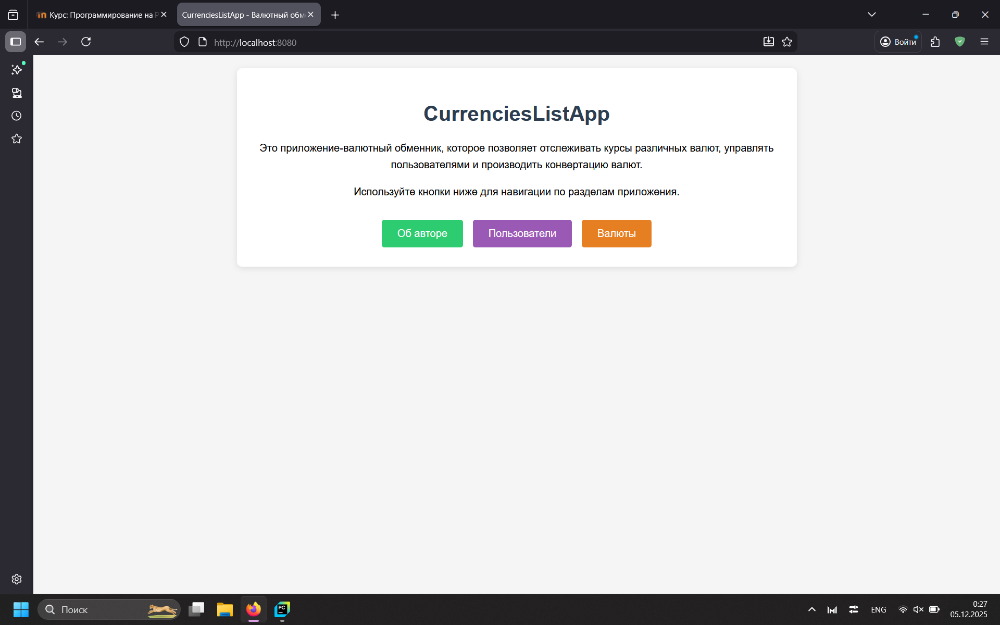
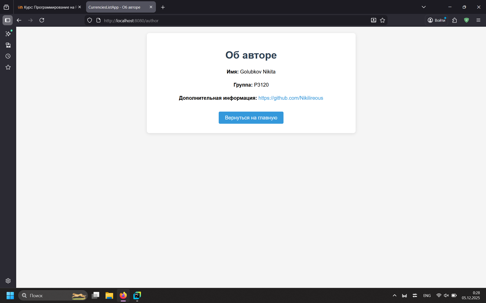
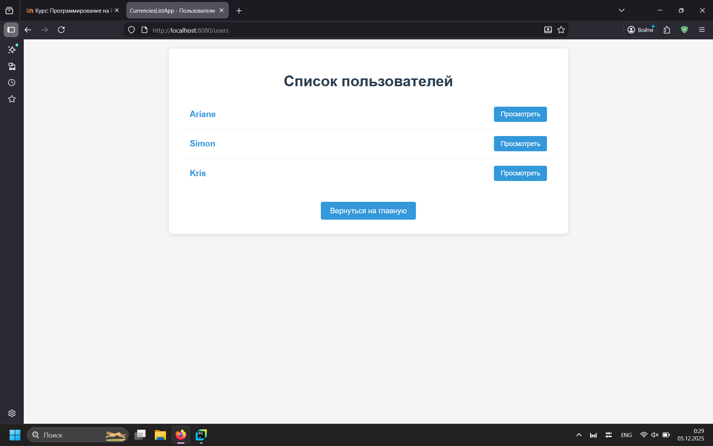
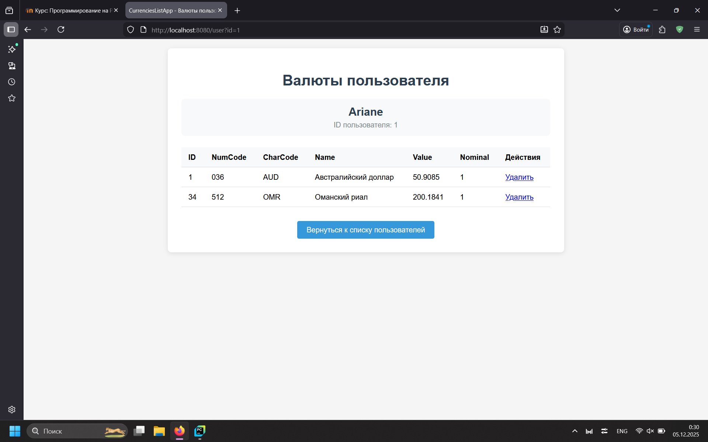
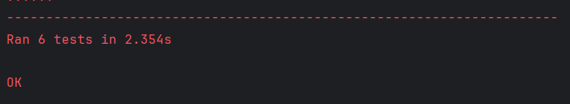

# Лабораторная работа 8. Клиент-серверное приложение на Python с использованием Jinja2.
Выполнена Голубковым Никитой

## Ход работы
Во время работы над проектом была придумана архитектура взаимодействия различных частей кода, используя методологию MVC,
реализованы необходимые модели, создана функция обращения к API Центрального Банка Российской Федерации,
а также успешно соединено в единый рабочий сайт для отслеживания актуальных кодировок валют.

## Описание моделей
Всего было реализовано пять различных моделей: модель информации приложения, автора приложения,
конкретной валюты, конкретного пользователя; модель-связка между пользователем и отслуживаемой им котировкой (с помощью единого id в будущей базе данных).
Кодовая связь моделей присутствует только у приложения и автора: в инициализации класса `App` требуется объект типа `Author`.

## Структура проекта


## Реализация
* У каждой модели есть стандартные методы: `getter` и `setter`, реализованные с помощью встроенного в Python декоратора `@property`.
* Маршрутизация запросов к серверу реализована с помощью встроенной библиотеки `http`, а корректная обработка запросов доступна с помощью парсинга пути с помощью инструментов библиотеки `urllib`.
* Шаблонизатор Jinja2 необходим для более простого и удобного отображения страниц. `Enviroment` позволяет настроить обработку html-страниц. В данном случае включается автоэкранирование для корректного считывания всех символов. Так же Jinja2 позволяет свободно передавать часть информации из кода в файл html.
* Функция `get-currencies` позволяет получать последние котировки с API Центрального Банка. Сейчас она вызывается при каждом переходе на страницу со всеми валютами или страницу с валютами конкретного пользователя. Позже это планируется привязать к времени или отдельному запросу для оптимизации.

## Примеры работы приложения







>Html-страницы сгенерированы искусственным интеллектом

## Тестирование
```python
from unittest import TestCase, main
from utils.currencies_api import get_currencies
from models import App, Author, User


class TestSite(TestCase):
    # Получение всех возможных котировок
    def test_get_all_currencies(self):
        self.assertIsInstance(get_currencies(), dict)

    # Получение определённой котировки по коду
    def test_get_some_currencies(self):
        self.assertIsInstance(get_currencies(['USD']), dict)

    # Неверная подача данных функции
    def test_currencies_invalid_input(self):
        self.assertRaises(TypeError, get_currencies, 123)

    # Тестирование геттеров и сеттеров моделей
    def test_App_getter(self):
        author = Author(name='Nikita', group='123', info='qwerty')
        app = App(name='someapp', version='1.1', author=author)
        self.assertEqual(app.name, 'someapp')
        self.assertEqual(app.author, author)

    def test_user_setter(self):
        user = User(user_id=55, name='V', password='$2b$12$CTb4DgIpIUwYi.DYdc2tyO.6pdGVa6xHb4j4PBw0R8T3Cysill8eG')
        self.assertEqual(user.name, 'V')
        user.name = 'Johnny'
        self.assertEqual(user.name, 'Johnny')

    # Неверная подача данных в сеттер
    def test_user_invalid_setter(self):
        user = User(user_id=512, name='Elster', password='$2b$12$pAsHXDFZM7OgBGeHit0fRuR1KMXZFzhJ7hGllS62mb6oAPXoNGupO')
        self.assertRaises(TypeError, user.name, 25512)
```


## Вывод
* В ходе реализации проекта не возникло каких-либо серьёзных проблем создания архитектуры или написания кода.
* Методология MVC использовалась для разделения блоков кода: модели отдельно от логики. В будущем, при добавлении базы данных, будет удобно также её вынести в отдельный блок реализации.
* В ходе работы были получены знания о создании простейшего сайта без использования веб-фреймворков, способах использования шаблонизатора для динамической настройки страниц, а также способе обращения к уже существующим API.