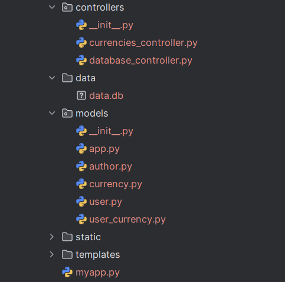
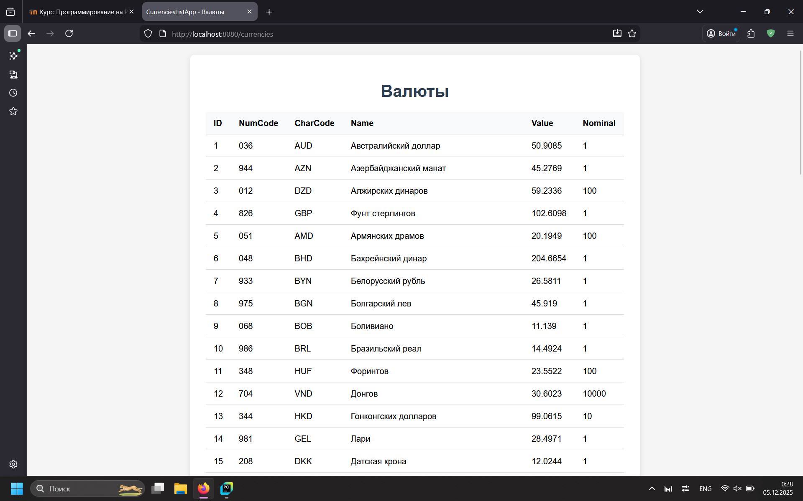
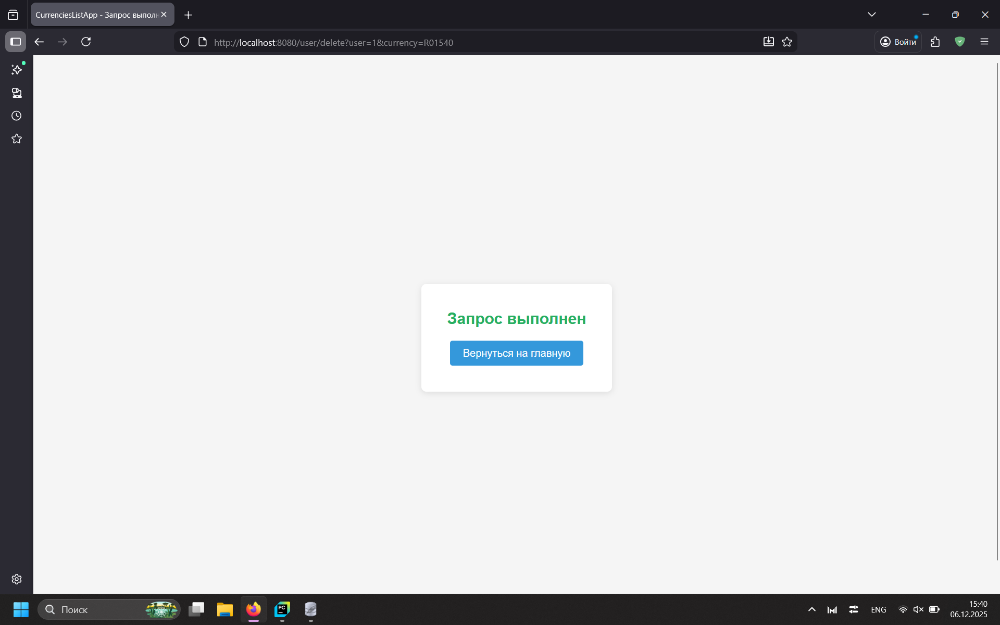
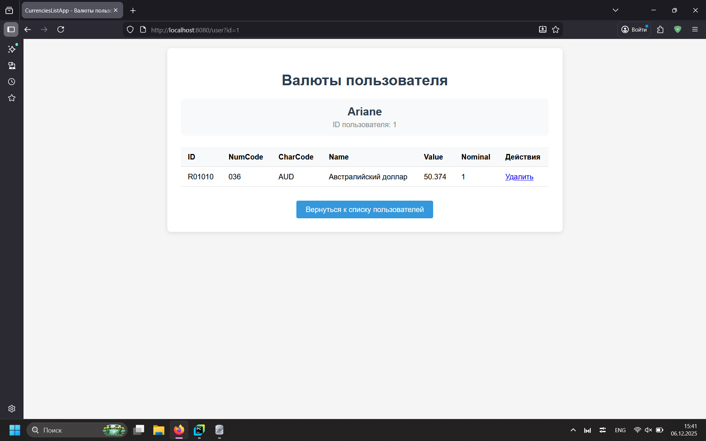
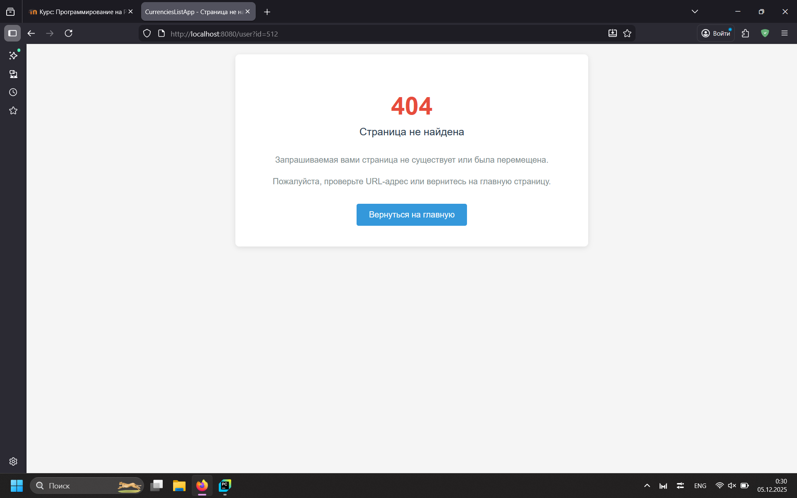
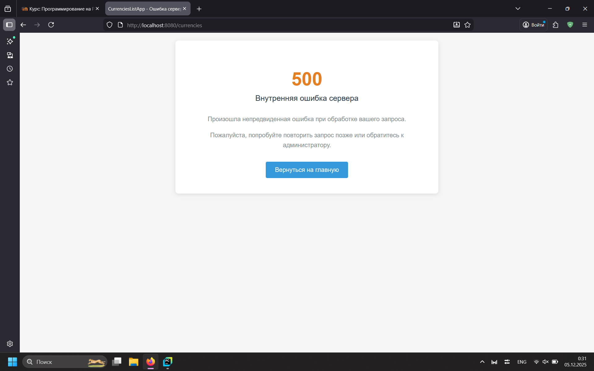

# Лабораторная работа 9. CRUD для приложения отслеживания курсов валют c SQLite базой данных.
Выполнена Голубковым Никитой

## Ход работы
Во время работы над проектом была улучшена архитектура сайта: добавлена возможность получения и добавления данных в базу данных.

## Описание моделей
Всего было реализовано пять различных моделей: модель информации приложения, автора приложения,
конкретной валюты, конкретного пользователя; модель-связка между пользователем и отслуживаемой им котировкой (с помощью единого id в будущей базе данных).
Кодовая связь моделей присутствует только у приложения и автора: в инициализации класса `App` требуется объект типа `Author`.

## Структура проекта


## Реализация
* На каждый класс была частично или полностью перенесена структура CRUD (Create, Read, Update, Delete).
* Пример read-запроса: `"SELECT * FROM Currencies"`, а также его дополнения с параметрами: `f'SELECT * FROM Currencies WHERE ValuteId == "{currency_id}"'`
* Доступна возможность добавления, как новых классов, так и добавления методов уже существующих (например добавление новых пользователей при регистрации).
* Функция `get-currencies` переписана с изменением структуры проекта.

## Примеры работы приложения





>Delete-запрос

>

>Страница того же пользователя после запроса

> 



>Html-страницы сгенерированы искусственным интеллектом

## Тестирование
```python
from unittest import TestCase, main
from controllers import AppCRUD
from models import App, Author, User, Currency


app_controller = AppCRUD('data/data.db')
class TestSite(TestCase):
    # Получение всех возможных котировок
    def test_get_all_currencies(self):
        self.assertIsInstance(app_controller._read_currencies(), list)

    # Получение определённой котировки по коду
    def test_get_some_currency(self):
        self.assertEqual(app_controller._read_currencies('R01010')[0].char_code, 'AUD')

    # Счёт несуществующей валюты
    def test_no_currency(self):
        self.assertListEqual(app_controller._read_currencies('123'), [])

    # Тестирование геттеров и сеттеров моделей
    def test_App_getter(self):
        author = Author(name='Nikita', group='123', info='qwerty')
        app = App(name='someapp', version='1.1', author=author)
        self.assertEqual(app.name, 'someapp')
        self.assertEqual(app.author, author)

    def test_user_setter(self):
        user = User(user_id=55, name='V', password='$2b$12$CTb4DgIpIUwYi.DYdc2tyO.6pdGVa6xHb4j4PBw0R8T3Cysill8eG')
        self.assertEqual(user.name, 'V')
        user.name = 'Johnny'
        self.assertEqual(user.name, 'Johnny')

    # Неверная подача данных в сеттер
    def test_user_invalid_setter(self):
        user = User(user_id=512, name='Elster', password='$2b$12$pAsHXDFZM7OgBGeHit0fRuR1KMXZFzhJ7hGllS62mb6oAPXoNGupO')
        self.assertRaises(TypeError, user.name, 25512)

if __name__ == '__main__':
    main()
```


## Вывод
* В ходе реализации проекта был улучшен код с предыдущей работы, с помощью добавление базы данных и работы с ней.
* Методология MVC на этот раз использовалась полностью: для работы с базой данных SQLite был вынесен компонент Controller. Рендеринг шаблонов происходил в запускающем файле, так как для корректного вызова get-запросов требовалась переменная изначального класса.
* Для работы с SQLite использовались стандартные функции курсора с написанными функциями обращения.